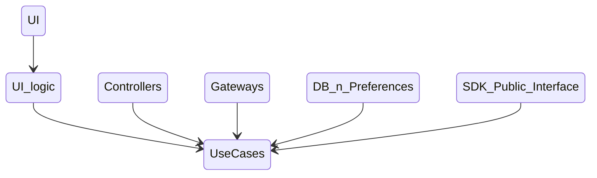
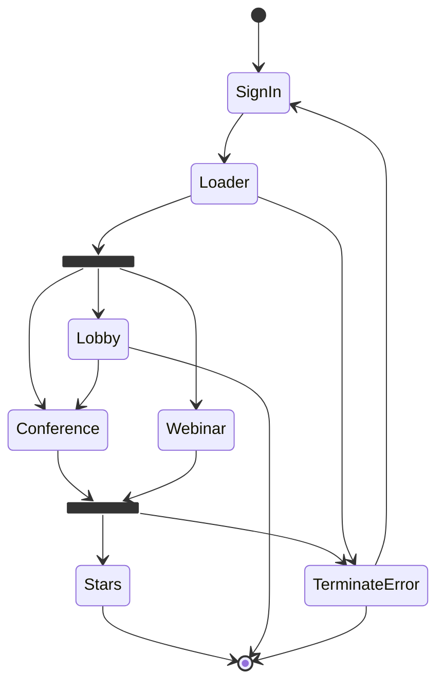
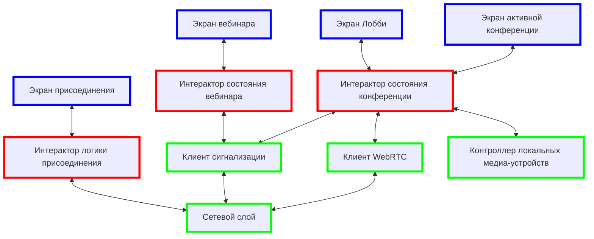

# Общая концепция

1) Допускается только "CleanArchitecture", то есть жесткие ограничения на зависимости сущностей.

   Схема зависимостей:



Здесь:

- **UI** - это композиция отображения - Compose-function, или Fragment + xml или Activity + xml. Но
  лучше первое.
- **UI-logic** - это ViewModel
- **Controllers** - классы взаимодействия с платформой или железом. Это могут быть большие пакеты со
  множеством классов и сложной структурой. Сюда же можно отнести обвес WebRTC, управление камерой,
  аудио подсистему и пр.
- Gateways - сетевой слой.
- **DB & Preferences** - это всякие репозитории для хранения данных
- **SDK Public Interface** - это интерфейс для сторонних клиентов в более широком смысле чем просто
  класс интерфейса. Все то, что нужно для общения в/из вне.
- **UseCases** - вот это чистая абстракция всех процессов внутри приложения, то есть "
  Бизнес-логика". В основном - это Iteractor'ы или аналогичные классы. Они не зависят ни от чего,
  кроме классов этого же уровня и доменных моделей. Логика должна работать также, если ее перенести
  на другую платформу. Если это не так, значит архитектура нарушена.
  Классы этого "доменного" слоя должны отвечать на вопрос "Что происходит?", но категорически не
  должны содержать "Как это происходит", за это отвечают компоненты, зависящие от доменного слоя.

2) Бизнес логика манипулирует абстракциями. Ее задача облегчение понимания кейсов без конкретики.
   Модели, которыми оперирует бизнес-логика, не должны учитывать технические особенности платформы
   или конкретного устройства. Если такие зависимости есть (например, isVisor), то модели с такими
   свойствами должны быть абстрактными.

3) Презентационный слой наоборот знает как должно все выглядеть, но не "заморачивается" на бизнес
   кейсах. Он с одной стороны подписывается на события бизнес-логики ("слушает изменения") и на
   основе изменений строит интерфейс. С другой стороны презентационный слой "слушает" действия
   пользователя и передает их в слой бинес-логики, но уже в абстракциях, понятных ей.

4) Презентационный слой всех элементов любого размера всегда должен состоять из 2-х частей:
   отрисовки и абстрации презентационного слоя. Используем локальный MVI в составе: compose +
   ViewModel. Основной профит в таком разделении: легкость восприятия функционала и декларативный
   подход, обеспечивающий единство ответственности.

5) Каждый экран вызывается и взаимодействует только только со своим родителем.
   Если нужно его показать - это зона ответственности родителя. Родитель ничего не знает (и не
   должен!) о внутренностях своих детей. Однако если это диалог или другой интерактивный элемент,
   находящийся на экране временно и возвращающий некоторый результат, то родитель может получить
   его. Для этого можно использовать:

- интерфейс, передаваемый "ребенку"
- родительскую вью-модель (ее время жизни всегда больше любого ребенка), обеспечивая правильные
  ключи при создании через фабрику
- общую бизнес-логику, если интерактор живет долго его могут слушать разные элементы интерфейса

5) Сдедующие понятия должны быть исключены, как противоречащие концепции.

- Интерактор должен отобразить диалог.
- Фича должна дернуть...
- Фича должна показать...
- Фича А вызывает фичу Б (или любые подобные комбинации в том числе "отображает", "дергает" и пр.)

6) Маршрутизация (или роутинг) - это переход по экранам с одновременным требуемым изменением
   бэкстека. Может применяться для отдельных "фичей", в которых действительно есть несколько
   полностью заменяющих друг друга экранов, например, "опросы" или "перенос касанием". Базовый
   функционал не требует никакой навигации из-за отсутствия необходимости переходов по окнам. Это
   лишь ненужное усложнение. Не надо путать маршрутизацию и вызов диалога из бизнес-логики.
   Последнее - это архитектурная ошибка, см. п.1.
   Маршрутизация должна выполнять только свою функцию - переход по экранам, то есть вызываться из UI
   слоя и его же представлять. Хотя внутри может использовать бизнес-логику по тем же принципам, что
   написаны выше.

# Состояния интерфейса базового активити



Так выглядит система переходов основных экранов. Каждый экран имеет свое внутреннее наполнение и
может иметь сложную логику, но базовая активити не управляет этим, ее компетенция заключается только
в переключении этих основных экранов.

Это просто, понятно и легко поддерживается. Легко добавить еще элемент, если в какой-то момент от
бизнеса поступит требование добавить еще, например, "карточную игру" или "платежный сервис" как еще
один шаг, например, после шага авторизации (или вместо лоадера, или вебинара и т.п.).

Легко изменить логику переходов, потому что это всего лишь `state + when`.

# Конференция

Интерфейс конференции состоит из нескольких композиций (блоков), которые могут быть видны поочередно
или одновременно в зависимости от типа экрана устройства или расположения (вертикально или
горизонтально).

Основные блоки (композиции):

- Видео в полноэкранном режиме
- Плитки с видео участников
- Чат
- Список участников
- Основные контролы (кнопки: чат, микрофон, трубка, камера, "дополнительно", настройки)
- Дополнительные контролы
- Уведомления
- Название конференции, таймер

Каждый элемент организует собственную часть экрана независимо от других элементов. UI конференции
является лишь "компоновщиком". Таким образом "видео", чат, список сотрудников, контролы и пр.
элементы могут присутствовать на экране, а могут и не отображаться. Каждый элемент независим и имеет
свою вью модель. Если элемент не отображается, то и связанная с ним UI-логика не выполняется. Логика
отображения отдельного элемента становится легче, потому что она не перегружена ничем лишним. Все
визуальные элементы в итоге привязаны к слою бизнес логики, который является абстракцией
конференции.

С другой стороны абстракция конференции используется контроллерами, обслуживающими физический
уровень (состояние камер, аудио системы, каналы связи с сервером, webrtc и пр.). Необходимо
обязательно соблюдать условия зависимостей. Бизнес логика зависит от контроллеров, но не наоборот.
Если включилась видеокамера или микрофон, контроллер сообщает об этом бизнес-логике. Контроллер
камеры может проверять некоторые флаги бизнес-логики, для ограничения возможности включения и т.п.

# Структурная схема взаимодействия блоков приложения



# Что еще проработать...

- [+] Lobby
- [+] Webinar
- [+] Ошибка "перезайти во встречу"
- [+] Параллельный диплинк -> продолжить / новая конференция
- "Раскраска" - как внешнее приложение может обеспечить собственную темизацию.
- SDK/пример
- Как из терминального состояния перейти в экран внешнего "вызывающего" приложения
  > Предварительно - никак. Это не задача Jazz'а думать об окнах вызывающего приложения.
  Откуда вызвали туда и вернемся при выходе.

Набросок фабрики UI для возможности подмены.

```kotlin
interface factory(
    val ui1 = @Composable ()->Unit
    val ui2 = @Composable ()->Unit
    val ui3 = @Composable ()->Unit
    val chat = @Composable ()->Unit
    val users = @Composable ()->Unit
    // ...
)
```

# Вопросы

- Что дают отдельные Gradle-модули?